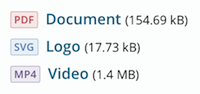

# kirby CMS - kirbytag: download
by Jannik Beyerstedt from Hamburg, Germany  
[jannikbeyerstedt.de](http://jannikbeyerstedt.de) | [Github](https://github.com/jbeyerstedt)  
**license:** GNU GPL v3

## Introduction
**return a beautiful download link for specific/ first/ last file or all files**

This kirbytag returns a beatiful download-link for a specific file in your site's content. It generates a link with a customizable text and dispays the filesize.

That's nothing special, but come some features for lazy people:  
You can choose your file, by the file categorization kirby uses (document, image, etc.) and the select by first or last. If you have a file, like a regularly updating flyer, you can keep going on with individual file names, but don't have to specify the name in the tag eveny time you change your file! Isn't this awesome?

## User Manual

### Installation
store this file in

	site/tags/

### Usage
Now you have a new kitbytext extension for download-links.  
The syntax is quite simple:

	(download: $keyword type: $filetype ext: $extension text: $someLinkText)

First thing to replace is `$keyword`. You can choose from:

- "first": selects the first file
- "last":  selects the last file
- "all": selects all files (of given type)
- or you can type some filename

Next we want to specify which files are affected. This is done with replacing `$filetype`. You can choose from the kirby file selectors:

- "image"
- "document"
- "archive"
- "code"
- "video"
- "audio"

To condense the selection further down, you can replace `$extension` and type a filename extension.

With the `text` attribute (replace `$someLinkText`) you can set a custom text which is displayed instead of the filename.

**Keep in mind**: Of course the pattern above is only an example and not working by copying it. If some placeholder (the things with `$` at the beginning) is not replaced, you have to delete the keyword infront of it too.


### Examples

	(download: first type: document)
	(download: flyer.pdf text: our beautiful products)


### Options

* `tags.download.class`: The class appended to the anchor-element (Default: `dl`)
* `tags.download.warnings`: Inlines warnings if for example the given file couldn't be found or the set is empty. (Default: `true`)

You can set these in your `config.php` like this:

	c::set('tags.download.class', 'fancyclass');

### File-Extensions
To customize the look of your download-links depending on the file-extension you can use either the appended data-attribute (i.e. `data-ext="pdf"`) or the modifier class (i.e. `class="dl dl--pdf"`) of the `<a>`-element.

#### Example



A look like this can be achieved with the following CSS:

```CSS
a.dl {
  @mixin colored-badge($color: gray) {
	   border-color: rgba($color, .3);
	   background: rgba($color, .1);
	   color: $color;
  }
	  
  &:before {
    @include colored-badge();
    content: attr(data-ext);
    text-transform: uppercase;
    // skipped irrelevant styling...
  }

  &--svg:before {
    @include colored-badge(#5A8BC2);
  }
  &--pdf:before {
    @include colored-badge(#C84D4F);
  }
  &--mp4:before {
    @include colored-badge(#7C6798);
  }
  // all the filetypes you wish...
}
```


## Contribution
Feel free to fork this repository and make it better.
